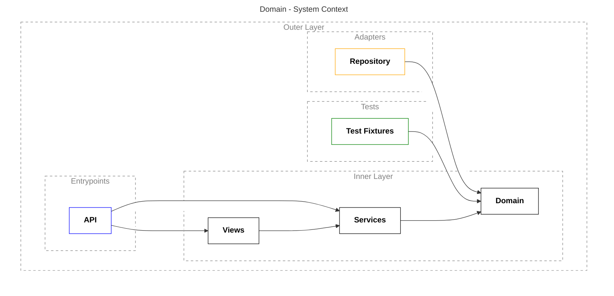

# Python microservice flavours

This repository is intended to demonstrate a set of different problems, approaches and peculiarities that one may encounter over the course of microservice development in Python.

Each catalog at this level contains a specific project.
<br />
<br />

## A couple words about the projects

Each project embodies such patterns as hexagonal (clean) architecture, event sourcing, and CQRS.

Each project contains three types of tests: modular, integration and end-to-end. Test coverage exceeds 80%.

Each project exploits linters, formatters, and type checkers, namely:
- black
- docformatter
- isort
- mypy
- pre-commit
- pylint
- ruff
- yamllint

Each project has a `docs` catalog with additional documentation on it, including C4 model and API design.
<br />
<br />

## Before launching a project

#### A few words about technologies used in these examples

Podman was chosen as the container management system.

Podman-compose was chosen as the implementation of [Compose Spec](https://compose-spec.io/) with Podman backend.

PostgreSQL was chosen as a relational database.

FastAPI was chosen as the target web framework.
<br />
<br />

#### Installing dependencies

Use the following command to install dependencies:

```shell
poetry install
```

or this one to update them:

```shell
poetry update
```
<br />

#### Installing `pre-commit`

Use the following command to install `pre-commit`:

```shell
make pre-commit
```
<br />

## Project launching

The `make` utility is used to run various commands in a project. All its arguments are written in the corresponding `Makefile` file. For example, to launch an application, simply run the following command in the terminal:

```shell
make up
```

If you are not going to use the `make` utility, then keep in mind that you will need to somehow register all the necessary environment variables (at the moment they are registered in the header of the `Makefile` file), otherwise neither the application, nor the tests will work.
<br />
<br />

## Testing

You can run all the tests of a project either like this:

```shell
make test-app
```

or like this:

```shell
# to run all tests:
poetry run pytest tests/

# to run unit tests only:
poetry run pytest tests/unit/

# to run a specific file only:
poetry run pytest tests/unit/test_commands.py

# to run a specific class only:
poetry run pytest tests/unit/test_commands.py::TestFlashcardFetchedFromGoogleApiEvent

# to run a specific test only:
poetry run pytest tests/unit/test_commands.py::TestFlashcardFetchedFromGoogleApiEvent::test_cannot_create_with_empty_word
# or if the test is located outside the class:
poetry run pytest tests/unit/test_commands.py::test_cannot_create_with_empty_word
```

However, do not forget that if you do not use the `make` utility, then you will have to register the environment variables in some other way, otherwise the tests will fail with an error.
<br />
<br />

## Hexagonal architecture

There is a kind of core around which everything else is built. This core is shown in the diagram as an `Inner Layer` and consists of `Views`, `Services` and `Domain`.

`Domain` is the domain model.
`Services` are command and event handlers.
`Views` are views that give us access to read data related to the domain model.

The core is a dependency for external conglomerates such as `Adapters`, `Entrypoints` and `Tests`. These conglomerates are not related to each other in any way, only to the core. Thus, the principle of dependency inversion is observed. This is the meaning of the hexagonal architecture.

The term *adapter* is closely related to the term *port*. The port is an abstraction, and the adapter is an implementation. The `Repository` is an SQLAlchemy implementation. In the code, I abstract working with it, since it is a low-level dependency. All low-level dependencies, especially those related to I/O, need to be abstracted so that the implementation can be easily changed.

What is considered a low-level dependency? This is all that business is not interested in. The easiest way to explain it is in some non-technical field. For example, if one is designing a banking application, then business is interested in terms such as deposit, currency, spread. And such things as a framework, a specific database, a cache, a business customer does not care much, he does not understand anything about it. Therefore, there should be a core with business logic, and one abstract all such details that the business does not operate with.

`Entrypoints` is not only the API, but also the module `main.py`. Ideally, we should be able to switch from FastAPI to something else if necessary. `Entrypoints` are arranged in such a way that they are not so easy to abstract, so they are displayed separately from adapters in the diagram. Nevertheless, the code is written in such a way that if one need to replace our FastAPI, for example, with a new fashionable framework, one will need to make a minimum number of changes – to the API itself, modules `main.py` and maybe `containers/wiring.py`.

`Tests` are fixtures, that is, what is pre–created and then implemented into our tests.


